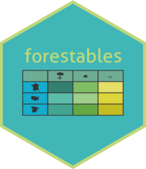

```{r, include = FALSE}
knitr::opts_chunk$set(
  collapse = TRUE,
  comment = "#>",
  fig.path = "man/figures/README-",
  out.width = "100%"
)
```

# forestables <a href="https://emf-creaf.github.io/forestables/"></a>

[](https://github.com/emf-creaf/forestables/actions/workflows/R-CMD-check_main.yaml)

Read and uniformize forest inventories data from the FIA (USA forest inventory), FFI (France forest
inventory) and IFN (Spain forest inventory).

## Installation

You can install the development version of forestables from
[GitHub](https://github.com/emf-creaf/forestables) with:

``` r
# install.packages("devtools")
devtools::install_github("emf-creaf/forestables")
```

## Inventories files

`forestables` offers download functions to get the inventory files from the official
websites from each inventory:

  - [FIA](https://www.fs.usda.gov/research/products/dataandtools/tools/fia-datamart)  
  - [FFI](https://inventaire-forestier.ign.fr/dataifn/?lang=en)  
  - IFN:
      - [IFN2](https://www.miteco.gob.es/es/biodiversidad/servicios/banco-datos-naturaleza/informacion-disponible/ifn2_descargas.html)
      - [IFN3](https://www.miteco.gob.es/es/biodiversidad/servicios/banco-datos-naturaleza/informacion-disponible/ifn3_bbdd_descargas_htm.html)
      (*accdb* are be used)
      - [IFN4](https://www.miteco.gob.es/es/biodiversidad/temas/inventarios-nacionales/inventario-forestal-nacional/cuarto_inventario.html)

We recommend to manually download and unzip the data in the desired folder.
Download functions are offered as helpers for programmatically approaches, but users should
be careful as data can be missing due to connection errors, link changes...

## Example

Download FFI (France forest inventory) and extract all plots from the Loire department for 2015:

```{r example_run}
library(forestables)
library(dplyr)

## Downloading all FFI data (if not already)
ffi_path <- tempdir()
download_inventory("FFI", destination = ffi_path)

## Get the plots
loire_plots_2015 <- ffi_to_tibble(
  "42",
  years = 2015,
  folder = ffi_path
) |>
  clean_empty(c("tree", "shrub", "regen")) |>
  inventory_as_sf()

## Explore the plots
loire_plots_2015
```