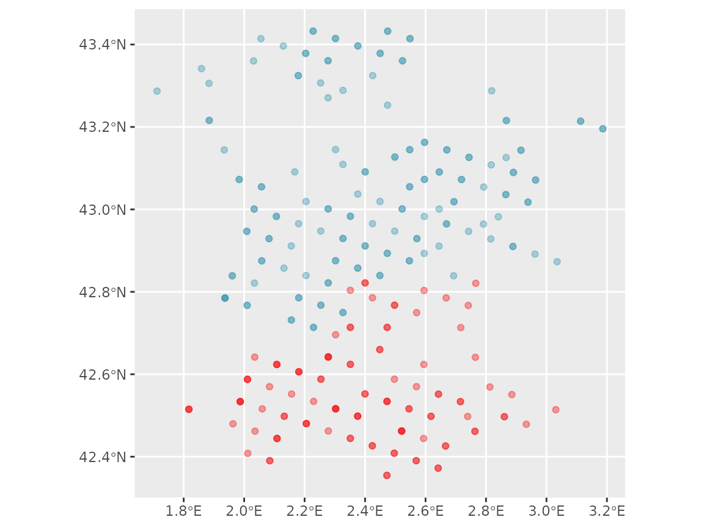
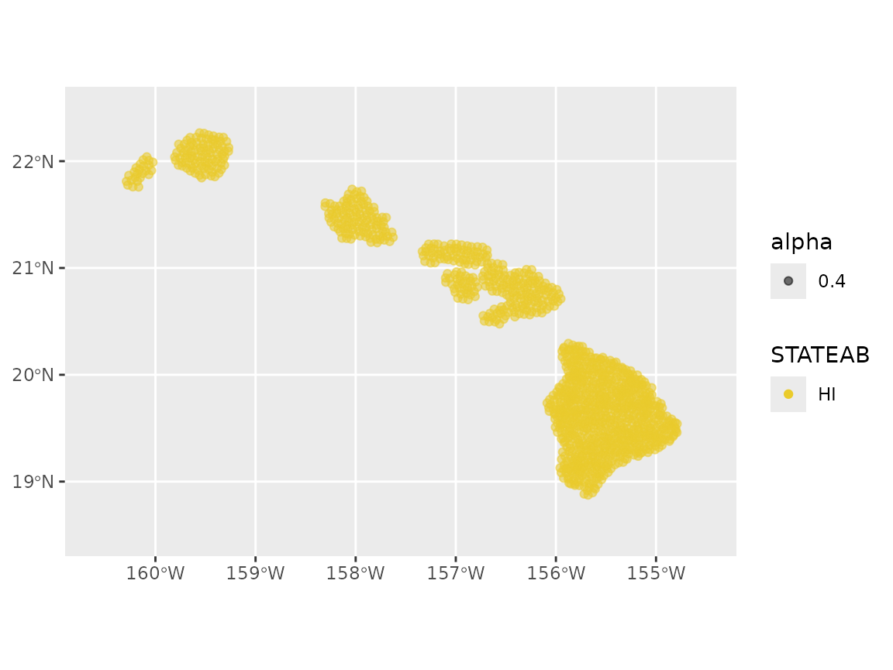
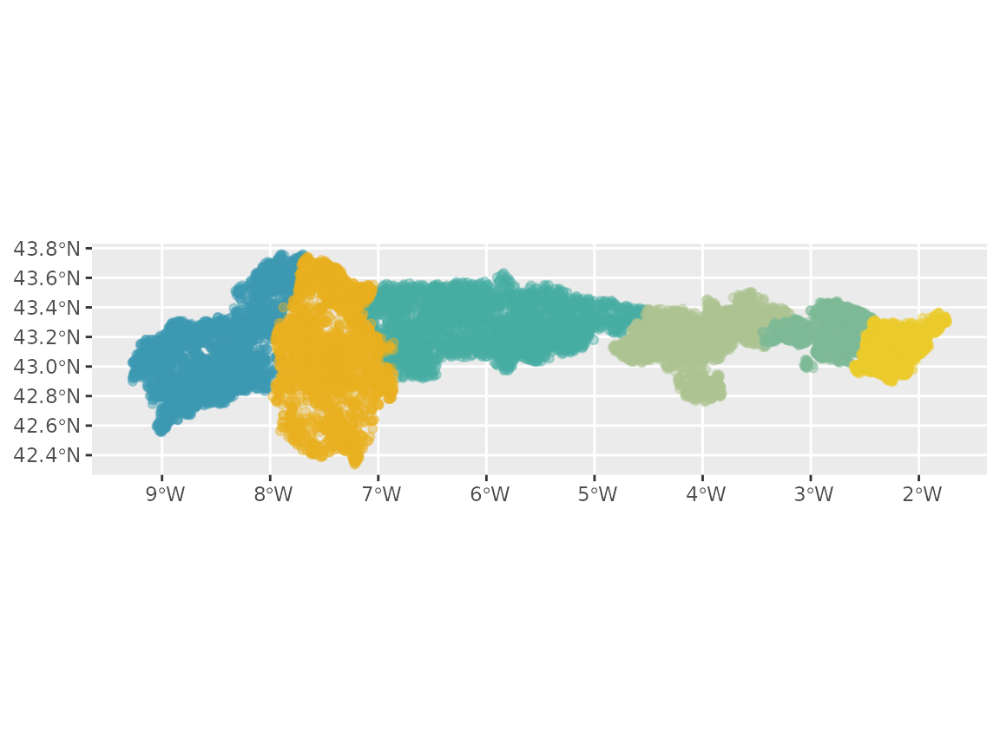
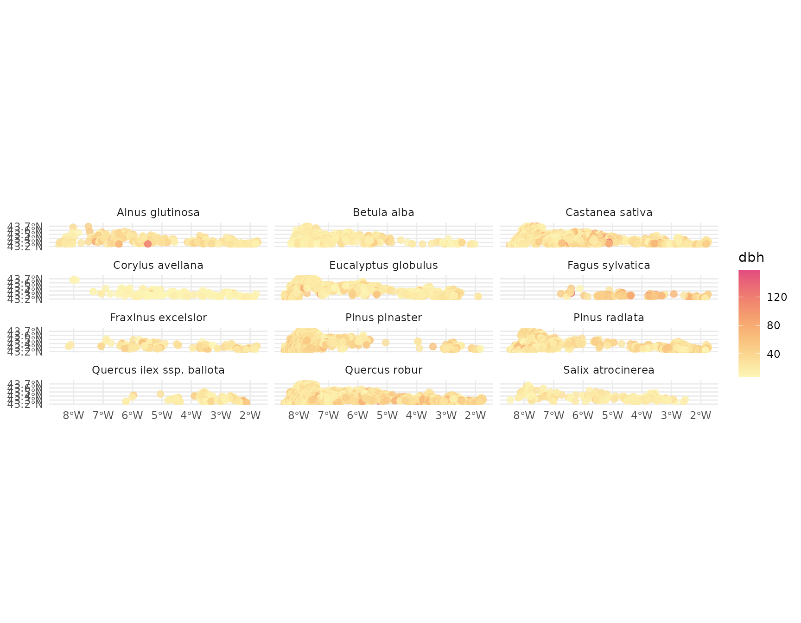

# Selecting plots

## Setup

``` r
# libraries
library(forestables)
#> Loading required package: data.table
#> Loading required package: dtplyr
library(dplyr)
#> 
#> Attaching package: 'dplyr'
#> The following objects are masked from 'package:data.table':
#> 
#>     between, first, last
#> The following objects are masked from 'package:stats':
#> 
#>     filter, lag
#> The following objects are masked from 'package:base':
#> 
#>     intersect, setdiff, setequal, union
library(sf)
#> Linking to GEOS 3.12.1, GDAL 3.8.4, PROJ 9.4.0; sf_use_s2() is TRUE
library(ggplot2)
library(stringr)
library(future)
```

This vignette explains how to retrieve information about available
inventory plots and using it to select them based to use in modelling or
analyses.

Workflows with all three inventories (FFI, FIA and IFN) are shown below

## FFI workflow

In this example for the French forest inventory (FFI) we will explore
the plots in the Eastern Pyrenees and Aude departments (codes “66” and
“11”) in the year 2012.  
First step is to download the inventory if we haven’t done it yet. As
this is a vignette, we will download the data to a temporary folder that
is removed after the R session ends. But is heavily recommended to
download the data to a permanent folder in your project/analysis.

``` r
# Download the FFI data if not already (In this example the data is downloaded
# in a temporal folder and is removed after the R session ends)
ffi_folder <- tempdir()
download_inventory("FFI", ffi_folder)
#> ℹ Downloading FFI available data
#> ℹ Unzipping downloaded data in /tmp/RtmpST1xgi
#> ✔ Done!
```

If we don’t want to perform any selection of plots and we need all plots
for 2012, then we can just retrieve all data:

``` r
ffi_2012_all_plots <- ffi_to_tibble(
  departments = c("66", "11"),
  years = 2012,
  folder = ffi_folder,
  clean_empty = "tree"
)
```

But in some cases we need to perform some plots selection, to reduce the
number of plots or simply to focus in the interesting plots for our
goal.  
For this, we can use the department codes to obtain some basic metadata
(plot codes, coordinates and campaign year) with
[`show_plots_from()`](https://emf-creaf.github.io/forestables/reference/show_plots_from.md).  
We need the inventory we want plots from, the folder containing the
downloaded inventory files and a vector with the department codes:

``` r
# get the plots for those departments
ffi_selected_plots <- show_plots_from(
  inventory = "FFI",
  folder = ffi_folder,
  departments = c("66", "11")
)
ffi_selected_plots
#> Simple feature collection with 3830 features and 3 fields
#> Geometry type: POINT
#> Dimension:     XY
#> Bounding box:  xmin: 1.711533 ymin: 42.34551 xmax: 3.186679 ymax: 43.45049
#> Geodetic CRS:  WGS 84
#> # A tibble: 3,830 × 4
#>    CAMPAGNE   IDP DEP              geometry
#>  *    <int> <int> <chr>         <POINT [°]>
#>  1     2005   132 11    (2.008273 43.05466)
#>  2     2005   257 66    (2.545421 42.53404)
#>  3     2005   405 11     (2.424819 43.0731)
#>  4     2005   909 11    (2.204115 43.12696)
#>  5     2005  1061 66    (2.375614 42.78569)
#>  6     2005  1203 11     (2.326722 43.3966)
#>  7     2005  1236 11    (1.908529 43.28791)
#>  8     2005  1949 66    (2.156803 42.57001)
#>  9     2005  2905 11     (2.62124 43.14463)
#> 10     2005  2922 11    (3.186679 43.21353)
#> # ℹ 3,820 more rows
```

These are all the plots present in those departments for all years, but
we want 2012 plots, so we filter the results by campaign year:

``` r
ffi_selected_plots <- ffi_selected_plots |>
  filter(CAMPAGNE == 2012)
ffi_selected_plots
#> Simple feature collection with 275 features and 3 fields
#> Geometry type: POINT
#> Dimension:     XY
#> Bounding box:  xmin: 1.711729 ymin: 42.3546 xmax: 3.186413 ymax: 43.43249
#> Geodetic CRS:  WGS 84
#> # A tibble: 275 × 4
#>    CAMPAGNE    IDP DEP              geometry
#>  *    <int>  <int> <chr>         <POINT [°]>
#>  1     2012 200809 11    (2.595977 42.98299)
#>  2     2012 201113 11     (2.547623 43.1448)
#>  3     2012 201148 66    (2.253964 42.58809)
#>  4     2012 201585 11    (2.670319 43.14449)
#>  5     2012 201971 11    (2.523783 43.36049)
#>  6     2012 202180 11     (2.40033 43.09108)
#>  7     2012 202822 11     (2.351273 42.9833)
#>  8     2012 203283 11    (2.302064 43.41457)
#>  9     2012 204589 11     (2.057275 43.0548)
#> 10     2012 209775 11    (2.522623 43.00111)
#> # ℹ 265 more rows
```

We can visualize the geographic distribution of plots selected:

``` r
ggplot(ffi_selected_plots) +
  geom_sf(
    aes(color = DEP), alpha = 0.4,
    show.legend = FALSE
  ) +
  scale_color_manual(values = hcl.colors(2, palette = "Zissou 1"))
```



For further selection we can filter by plot identifier (IDP) if we know
them or use an spatial polygon to filter by coordinates. Let’s say we
are interested in these departments, but only in the mediterranean part.
We can then select those plots and create a *filter list* to use it to
retrieve those plots data from the inventory files:

``` r
# the area we want the plots in:
mediterranean_area <- st_bbox(
  c(xmin = 2.6, xmax = 3.2, ymax = 42, ymin = 44),
  crs = st_crs(4326)
) |>
  sf::st_as_sfc()

# create the filter list
ffi_filter_list <- ffi_selected_plots |>
  st_filter(mediterranean_area) |>
  create_filter_list()

## we can do all in one pipe:
# ffi_filter_list <-
#   show_plots_from("FFI", folder = ffi_folder, departments = c("66", "11")) |>
#   filter(CAMPAGNE == 2012) |>
#   st_filter(mediterranean_area) |>
#   create_filter_list()
```

And now we can just modify the `ffi_to_tibble` call we did above to add
the filter list:

``` r
## We can parallelize the process with the future package.
## In this case we use 4 parallel processes
library(future)
plan("multisession", workers = 4)

# get the data for the selected plots
ffi_data_2012 <- ffi_to_tibble(
  departments = c("66", "11"),
  years = 2012,
  filter_list = ffi_filter_list,
  folder = ffi_folder
)
#> Start
#> ℹ Processing 1 year
#> Getting ready to retrieve 208 plots for 2012

ffi_data_2012
#> # A tibble: 208 × 16
#>    id_unique_code  year plot  coordx coordy coord_sys   crs aspect slope country
#>    <chr>          <dbl> <chr>  <dbl>  <dbl> <chr>     <dbl>  <dbl> <int> <chr>  
#>  1 FR_11_200809    2012 2008… 6.67e5 6.21e6 LAMBERT    2154  162      15 FR     
#>  2 FR_11_201113    2012 2011… 6.63e5 6.23e6 LAMBERT    2154   22.5    40 FR     
#>  3 FR_11_201971    2012 2019… 6.61e5 6.25e6 LAMBERT    2154  151.     10 FR     
#>  4 FR_11_202180    2012 2021… 6.51e5 6.22e6 LAMBERT    2154  236.     52 FR     
#>  5 FR_11_202822    2012 2028… 6.47e5 6.21e6 LAMBERT    2154  176.     25 FR     
#>  6 FR_11_203283    2012 2032… 6.43e5 6.26e6 LAMBERT    2154  311.      8 FR     
#>  7 FR_11_204589    2012 2045… 6.23e5 6.22e6 LAMBERT    2154  279      16 FR     
#>  8 FR_11_209775    2012 2097… 6.61e5 6.21e6 LAMBERT    2154   19.8    36 FR     
#>  9 FR_11_213434    2012 2134… 6.57e5 6.20e6 LAMBERT    2154  328.      7 FR     
#> 10 FR_11_217286    2012 2172… 6.41e5 6.25e6 LAMBERT    2154   NA       0 FR     
#> # ℹ 198 more rows
#> # ℹ 6 more variables: dep <chr>, dep_name <chr>, visite <int>, tree <list>,
#> #   understory <list>, regen <list>
```

Now we can explore the data, for example the most abundant species and
their mean diameter for each plot they are in:

``` r
ffi_data_2012 |>
  # clean plots without tree data
  clean_empty(c("tree")) |>
  # convert inventory table to sf/spatial object
  inventory_as_sf() |>
  # unnest the tree data
  unnest("tree") |>
  # calculate dbh by species in each plot
  dplyr::group_by(id_unique_code, sp_name) |>
  dplyr::summarise(dbh = mean(dbh, na.rm = TRUE), dep = unique(dep), n = n()) |>
  dplyr::filter(!is.nan(dbh)) |>
  # filter species with 2 or more entries (plots)
  dplyr::group_by(sp_name) |>
  dplyr::mutate(n = n()) |>
  dplyr::filter(n > 1) |>
  # let's plot
  ggplot() +
  geom_sf(aes(geometry = geometry, color = dbh), size = 2.2, alpha = 0.8) +
  scale_color_gradientn(colors = hcl.colors(360, "PinkYl", rev = TRUE)) +
  facet_wrap(~sp_name, ncol = 4) +
  theme_minimal()
#> `summarise()` has grouped output by 'id_unique_code'. You can override using
#> the `.groups` argument.
```


## FIA workflow

For the USA forest inventory (FIA) we are going to explore the Hawaii
inventory plots for 2019. The steps are very similar to the FFI example.
First we need the state code, retrieve the plots metadata and filter for
the desired year, 2019:

``` r
# download the FIA data if not already (In this example the data is downloaded
# in a temporal folder and is removed after the R session ends)
fia_folder <- tempdir()
download_inventory("FIA", fia_folder, states = "HI")
#> ℹ Downloading FIA available data
#> ℹ Unzipping downloaded data in /tmp/RtmpST1xgi
#> ✔ Done!

# get the plots for those departments
hawaii_plots_2019 <- show_plots_from(
  inventory = "FIA",
  folder = fia_folder,
  states = "HI"
) |>
  filter(INVYR == 2019)
hawaii_plots_2019
#> Simple feature collection with 1177 features and 5 fields
#> Geometry type: POINT
#> Dimension:     XY
#> Bounding box:  xmin: -160.2893 ymin: 18.87413 xmax: -154.7896 ymax: 22.26451
#> Geodetic CRS:  WGS 84
#> # A tibble: 1,177 × 6
#>    INVYR STATECD COUNTYCD  PLOT STATEAB             geometry
#>  * <int>   <int>    <int> <int> <chr>            <POINT [°]>
#>  1  2019      15        1  2125 HI       (-155.875 20.29327)
#>  2  2019      15        1  2127 HI      (-155.8317 20.27703)
#>  3  2019      15        1  2130 HI      (-155.7942 20.26314)
#>  4  2019      15        1  2133 HI      (-155.7351 20.26385)
#>  5  2019      15        1  2137 HI      (-155.9226 20.24566)
#>  6  2019      15        1  2140 HI      (-155.8627 20.23504)
#>  7  2019      15        1  2143 HI      (-155.8276 20.23026)
#>  8  2019      15        1  2146 HI      (-155.7559 20.21695)
#>  9  2019      15        1  2149 HI      (-155.7324 20.21962)
#> 10  2019      15        1  2150 HI      (-155.9376 20.22124)
#> # ℹ 1,167 more rows
```

We can visualize the geographic distribution of the plots:

``` r
# USA map for plotting
ggplot(hawaii_plots_2019) +
  geom_sf(aes(color = STATEAB, alpha = 0.4)) +
  coord_sf(xlim = c(-160.6, -154.5), ylim = c(18.5, 22.5)) +
  scale_color_manual(values = hcl.colors(1, palette = "Zissou 1"))
```



Now that we have the all forest inventory plots selected, we can create
a *filter list* to retrieve the data only from those we want, *i.e.*
only the O’ahu island:

``` r
oahu <- st_bbox(
  c(xmin = -157.5, xmax = -158.5, ymax = 21, ymin = 22),
  crs = st_crs(4326)
) |>
  sf::st_as_sfc()
fia_filter_list <- hawaii_plots_2019 |>
  st_filter(oahu) |>
  create_filter_list()
```

And now we have everything we need for retrieving the data with
[`fia_to_tibble()`](https://emf-creaf.github.io/forestables/reference/fia_to_tibble.md).
For that we need to provide the state codes, the year, the filter list
we obtained before and the path to the folder containing the forest
inventory files.

``` r
## We can parallelize the process with the future package.
## In this case we use 4 parallel processes
library(future)
plan("multisession", workers = 4)

# get the data
fia_data_2019 <- fia_to_tibble(
  states = "HI",
  years = 2019,
  filter_list = fia_filter_list,
  folder = fia_folder
)
#> Start
#> ℹ Processing 1 year
#> Getting ready to retrieve 109 plots for 2019
```

As we did with the French forest inventory, we can now explore the data,
for example, the most abundant species and their mean diameter:

``` r
fia_data_2019 |>
  # clean plots without tree data
  clean_empty(c("tree")) |>
  # convert inventory table to sf/spatial object
  inventory_as_sf() |>
  # unnest the tree data
  unnest("tree") |>
  # calculate dbh by species in each plot
  dplyr::group_by(id_unique_code, sp_name) |>
  dplyr::summarise(
    dbh = mean(dbh, na.rm = TRUE),
    state_ab = unique(state_ab), n = n()
  ) |>
  dplyr::filter(!is.nan(dbh)) |>
  # filter species with 5 or more entries (plots)
  dplyr::group_by(sp_name) |>
  dplyr::mutate(n = n()) |>
  dplyr::filter(n > 5) |>
  # let's plot
  ggplot() +
  geom_sf(aes(geometry = geometry, color = dbh), size = 2.2, alpha = 0.8) +
  scale_color_gradientn(colors = hcl.colors(360, "PinkYl", rev = TRUE)) +
  facet_wrap(~sp_name, ncol = 4) +
  theme_minimal()
#> `summarise()` has grouped output by 'id_unique_code'. You can override using
#> the `.groups` argument.
```


## IFN workflow

For the Spanish forest inventory (IFN) we will explore the Cantabric
coast forest plots. The IFN, differently from other national
inventories, doe not offer the plot data by years, but by *versions*. We
have *“ifn2”* (early 90s), *“ifn3” (early 00s)* and *“ifn4”*
(2014-15).  
We are going o retrieve the plots for the early 00s version (*“ifn3”*):

``` r
# download the IFN data if not already (In this example the data is downloaded
# in a temporal folder and is removed after the R session ends)
ifn_folder <- tempdir()
download_inventory("IFN", ifn_folder)
#> ℹ Downloading IFN available data
#> ℹ Unzipping downloaded data in /tmp/RtmpST1xgi
#> ✔ Done!

# choose the provinces, those in the Cantabric area
north_spain_provinces <- c("33", "15", "27", "39", "48", "20")

# get the plots for those departments
north_spain_plots <- show_plots_from(
  "IFN",
  folder = ifn_folder,
  provinces = north_spain_provinces, versions = "ifn3"
)
north_spain_plots
#> Simple feature collection with 12849 features and 6 fields
#> Geometry type: POINT
#> Dimension:     XY
#> Bounding box:  xmin: -9.271574 ymin: 42.33747 xmax: -1.743428 ymax: 43.7598
#> Geodetic CRS:  WGS 84
#> First 10 features:
#>      crs   id_unique_code version province_code province_name_original plot
#> 1  23029 33_0001_xx_NN_xx    ifn3            33               Asturias 0001
#> 2  23029 33_0002_xx_NN_A1    ifn3            33               Asturias 0002
#> 3  23029 33_0003_xx_NN_xx    ifn3            33               Asturias 0003
#> 4  23029 33_0004_xx_NN_xx    ifn3            33               Asturias 0004
#> 5  23029 33_0005_xx_NN_A1    ifn3            33               Asturias 0005
#> 6  23029 33_0006_xx_NN_A1    ifn3            33               Asturias 0006
#> 7  23029 33_0007_xx_NN_A1    ifn3            33               Asturias 0007
#> 8  23029 33_0008_xx_NN_xx    ifn3            33               Asturias 0008
#> 9  23029 33_0009_xx_NN_A1    ifn3            33               Asturias 0009
#> 10 23029 33_0010_xx_NN_A1    ifn3            33               Asturias 0010
#>                      geometry
#> 1  POINT (-6.921532 43.55715)
#> 2   POINT (-6.946584 43.5486)
#> 3   POINT (-6.897099 43.5477)
#> 4  POINT (-6.859986 43.54701)
#> 5  POINT (-6.959259 43.53982)
#> 6  POINT (-6.922459 43.53015)
#> 7  POINT (-6.860623 43.52901)
#> 8     POINT (-6.9475 43.5216)
#> 9  POINT (-6.910402 43.52093)
#> 10 POINT (-6.860941 43.52001)
```

To visualize the geographic distribution plots we can use:

``` r
ggplot(north_spain_plots) +
  geom_sf(
    aes(color = province_name_original), alpha = 0.4,
    show.legend = FALSE
  ) +
  scale_color_manual(values = hcl.colors(9, palette = "Zissou 1"))
```



Now that we have the inventory plots selected, we can obtain the *filter
list* to retrieve the data only from the cantabric area:

``` r
cantabric_area <- st_bbox(
  c(xmin = -1, xmax = -8.5, ymax = 44, ymin = 43.2),
  crs = st_crs(4326)
) |>
  sf::st_as_sfc()
ifn_filter_list <- north_spain_plots |>
  st_filter(cantabric_area) |>
  create_filter_list()

## we can do all in one pipe:
# ifn_filter_list <- show_plots_from(
#    "IFN", folder = ifn_folder, provinces = north_spain_provinces, versions = "ifn3"
# ) |>
#   create_filter_list()
```

And now we have everything we need for retrieving the data with
[`ifn_to_tibble()`](https://emf-creaf.github.io/forestables/reference/ifn_to_tibble.md):

``` r
## We can parallelize the process with the future package.
## In this case we use 4 parallel processes
library(future)
plan("multisession", workers = 4)

# get the data
ifn_data <- ifn_to_tibble(
  provinces = north_spain_provinces,
  versions = "ifn3",
  filter_list = ifn_filter_list,
  folder = ifn_folder
)
#> Start
#> ℹ Processing 1 versions
#> Getting ready to retrieve 8015 plots for "ifn3"
```

As we did with the French and USA national forest inventories, we can
now explore the data, for example, the most abundant species and their
mean diameter:

``` r
ifn_data |>
  # clean plots without tree data
  clean_empty(c("tree")) |>
  # convert inventory table to sf/spatial object
  inventory_as_sf() |>
  # unnest the tree data
  unnest("tree") |>
  # calculate dbh by species in each plot
  dplyr::group_by(id_unique_code, sp_name) |>
  dplyr::summarise(
    dbh = mean(dbh, na.rm = TRUE),
    province_name_original = unique(province_name_original), n = n()
  ) |>
  dplyr::filter(!is.nan(dbh), !is.na(sp_name)) |>
  # filter species with 5 or less entries (plots)
  dplyr::group_by(sp_name) |>
  dplyr::mutate(n = n()) |>
  dplyr::filter(n > 80) |>
  # let's plot
  ggplot() +
  geom_sf(aes(geometry = geometry, color = dbh), size = 2.2, alpha = 0.8) +
  scale_color_gradientn(colors = hcl.colors(360, "PinkYl", rev = TRUE)) +
  facet_wrap(~sp_name, ncol = 3) +
  theme_minimal()
#> `summarise()` has grouped output by 'id_unique_code'. You can override using
#> the `.groups` argument.
```


