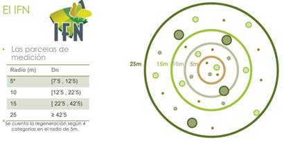

```{r, include = FALSE}
knitr::opts_chunk$set(
  collapse = TRUE,
  comment = "#>"
)
```

```{r setup}
library(esus)
```

# Introduction

\
Introduction

This vignette documents the most important processes in handling official data sources from the national forest inventories of France, the United States, and Spain.

# IFN : data processins

## Individual functions for IFN tables

### IFN TREE TABLE PROCESS

Comes from *PCMAYORES* table of IFN.\
\
**Units**:\
DIA (diameter)= cm\
HT (height) = m\
\
This function performs a set of operations to obtain the final table.

Firstly, names are harmonized as follows:

*province_code = PROVINCIA,\
PLOT = ESTADILLO,\
SP_CODE = ESPECIE,\
TREE = nARBOL,\
Dn1 = DIAMETRO1,\
Dn2 = DIAMETRO2,\
HT = ALTURA*\

| Harmonized name | Original name IFN2 | Original name IFN3/ 4 |
|-----------------|--------------------|-----------------------|
| PLOT            | ESTADILLO          | Estadillo             |
| Height (cm)     | *ALTUMED (dm?)*    | Hm (dm?)              |
| SP_CODE         | ESPECIE            | Especie               |
| *province_code* | *PROVINCIA*        | Provincia             |
| TREE            | ARBOL              | nArbol                |
| Dn1             | DIAMETRO1          | Dn1                   |
| Dn2             | DIAMETRO2          | Dn2                   |
| HT              | ALTURA             | Ht                    |

\
The mean of diameters is calculated to obtain the variable DIA (diameter/DBH), and it is converted to cm.

```         
  DIA = ((Dn1 + Dn2) / 2) * 0.1, # From mm to cm
```

The density variable is similar to the FAC variable in the inventory, which corresponds to the Expansion Factor per hectare of the unit values of different dendrometric parameters of the measured foot. Smaller trees are measured at smaller radii of the plot, while larger trees are measured within a 25m radius, which is why the density value changes.

```         
DIA < 12.5 ~ 127.3239546,
DIA >= 12.5 & DIA < 22.5 ~ 31.83098865,
DIA >= 22.5 & DIA < 42.5 ~ 14.14710607,
DIA >= 42.5 ~ 5.092958185
```

# {width="311"}

## IFN SHRUB TABLE PROCESS

Comes from the table *PCMatorral* of the IFN\
Firstly, names are harmonized.

| Harmonized name | Original name IFN2 | Original name IFN3/ 4 |
|-----------------|--------------------|-----------------------|
| PLOT            | ESTADILLO          | Estadillo             |
| Height (cm)     | *ALTUMED (dm?)*    | Hm (dm?)              |
| SP_CODE         | ESPECIE            | Especie               |
| *province_code* | *PROVINCIA*        | Provincia             |
| *COVER*         | *FRACCAB*          | Fcc                   |

\
**Units:**

HT (Height) = cm\
\
This function performs a set of operations to obtain the final table.

## IFN REGEN TABLE PROCESS

Comes from the table *PCRegenera* of IFN 3-4 or *PIESME* del IFN2

Firstly, names are harmonized.

| Harmonized name | Original name IFN2 | Original name IFN3/ 4 |
|-----------------|--------------------|-----------------------|
| PLOT            | ESTADILLO          | Estadillo             |
| Height (cm)     | *ALTUMED (dm?)*    | Hm (dm?)              |
| SP_CODE         | ESPECIE            | Especie               |
| *province_code* | *PROVINCIA*        | Provincia             |

The data regeneration is approached differently in the IFN3-4 compared to the IFN2, thus the processing is different

***For IFN2 :***

**Original codes**\
Numero : number of trees of a given species with a diameter between 25 and 75 mm in the 5m radius\
R : avaraged number of trees of a given species with a diameter below 25 mm in the 5m radius\
{width="154"}\
For those with a diameter above 75mm the mean height is recorded in variable ALTUMED

To uniform all information and separate each record in a different file there are some assumptions/ default values. Additionally, new variables are generated (DBH, DENSITY, N)\

Height for individuals below 25 mm = 100cm

DBH for individuals below 25 mm = 1 cm\
DBH for individuals above 25 mm = 5 cm\
DENSITY (FAC) for all records is 127.3239546 as they are collected in the 5m radius

N ( is actual density in trees/ ha ) is calculated by multiplying *Numero* \* *DENSITY.*\
For those records with REGENA coges, the mid point of the interval is assumed to be the actual number of species .

```         
if Regena == 1 ~ Numero = 2.5,
if Regena == 2 ~ Numero = 10 ,
if Regena == 3 ~ Numero = 20
```

N = DENSITY \* Numero

**For IFN3 - 4**

**Original variables** are

"CatDes", "NumPies", "Densidad", "Hm"

Category 1: Trees with height less than 30 cm.

Category 2: Trees with height between 30 and 130 cm.

Category 3: Trees with height greater than 130 cm and normal diameter less than 2.5 cm.

Category 4: Trees with height greater than 130 cm and normal diameter between 2.5 and 7.5 cm. This corresponds to smaller trees (PIESMENORES) in IFN2.

Depending on the development category (*CatDes*), the regeneration densities will be quantified differently:

For development categories 1, 2, and 3, counting the trees in the circular plot of 5 m radius and classifying the density according to the following scale:

1.  Sparse: 1 to 4 trees in the plot.

2.  Normal: 5 to 15 trees in the plot.

3.  Abundant: More than 15 trees in the plot.

For development category 4, by species, count those present in the 5 m radius subplot and record in the corresponding box ("NumPies") and the average total height of each group is also calculated ( Hm ) , approximately.

Additionally new variables are generated and some assumption are made to uniform the information:\
Density = FAC Expansion Factor per hectare wich is always 127.3239546

*DBH = diameter at breast height in cm*

if *CatDes* == 1 \~ 0.1, if *CatDes* == 2 \~ 0.5, if *CatDes* == 3 \~ 1.5, if *CatDes* == 4 \~ 5,

*N = density in meters per ha*

So if *CatDes* == 1 \~ NumPies = 2.5 , if *CatDes* == 2 \~ NumPies = 10 , if *CatDes* == 3 \~ NumPies = 20, for *CatDes* == 4 \~ NumPies ,

Therefore it is calculated as follows = N = DENSITY \* NumPies

*Height (cm)*

if *CatDes* == 1 \~ 10, if *CatDes* == 2 \~ 80, if *CatDes* == 3 \~ 100, for *CatDes* == 4 \~ Hm,

# Referencias

Incluye referencias bibliográficas si es necesario.
