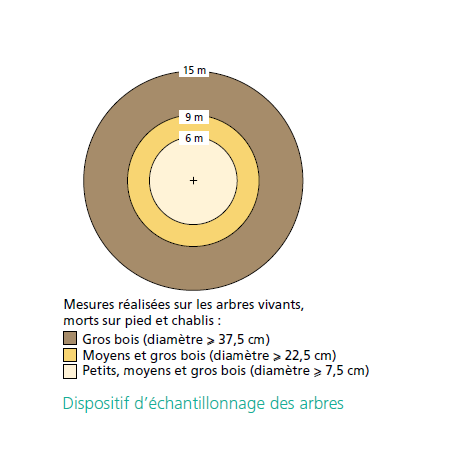
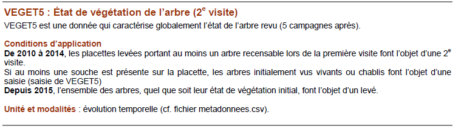

------------------------------------------------------------------------

---
title: "Description of functions"
output: rmarkdown::html_vignette
author: "Adriana Tovar"
date: "`r Sys.Date()`"
vignette: >
  %\VignetteIndexEntry{documentacion}
  %\VignetteEngine{knitr::rmarkdown}
  %\VignetteEncoding{UTF-8}
---

```{r, include = FALSE}
knitr::opts_chunk$set(
  collapse = TRUE,
  comment = "#>"
)
```

```{r setup}
library(esus)
```

# Introduction

\
This vignette documents the most important processes in handling official data sources from the national forest inventories of France, the United States, and Spain.

# IFN (SPAIN): data processing

**The National Forest Inventory (IFN)** is a project that provides national-level information on forests and their evolution from both a taxonomic and ecological perspective. With a periodicity of at least ten years, it has been ongoing for over fifty years.

The **Second National Forest Inventory (IFN2) was conducted by the Forest Inventory Service between 1986 and 1996.** It consisted of fixed plots located using a metal grid buried at the center of each plot, allowing for the periodic measurement of each tree and the comparison of their physical characteristics and condition.

The **Third cycle** of the **National Forest Inventory (IFN3) was carried out between 1997 and 2007**. While it followed the methodology established in IFN2, with a focus on continuous monitoring of the same plots, it introduced changes by considering forest ecosystems for the first time. IFN3 aimed to provide insights into the state and evolution of forests at the provincial level through over 100 indicators.

The **Fourth cycle of the National Forest Inventory (IFN4)** **started in 2008**.While IFN4 continues the methodology of its predecessors, it incorporates changes and innovations.Among the main novelties of this fourth cycle (IFN4) is the use of the Forest Map of Spain at a scale of 1:25,000 (MFE) as the cartographic base.

## **Data acquisition:**

-   IFN2 : Ficheros de parcelas y procesos de datos:

    Data is organized in provinces and there are thematic DBF files with similar names for all provinces.

    <https://www.miteco.gob.es/es/biodiversidad/servicios/banco-datos-naturaleza/informacion-disponible/ifn2_descargas.html>

-   IFN 3: Bases de datos (Access 2007 \*.accdb)

    Data is organized in provinces and each province one has an access file. Within the access files there are thematic sheets with similar names.

    <https://www.miteco.gob.es/es/biodiversidad/servicios/banco-datos-naturaleza/informacion-disponible/ifn3_bbdd_descargas_htm.html>

-   IFN4 : Bases de datos de campo. (Access 2007 \*.accdb)

    Data is organized in provinces/ Autonomous community with an internal organization similar to IFN3.

    <https://www.miteco.gob.es/es/biodiversidad/temas/inventarios-nacionales/inventario-forestal-nacional/cuarto_inventario.html>

## Individual functions for IFN tables

Variables have been harmonized between inventories.\
Some variables may appear on multiple tables:

| Harmonized name | Original name IFN2              | Original name IFN3/ 4  | Description                                                                 |
|-----------------|---------------------------------|------------------------|-----------------------------------------------------------------------------|
| ID_UNIQUE_PLOT  | ES_ESTADILLO\_ PROVINCIA        | ES_Estadillo_Provincia | Code to identify plot                                                       |
| province_code   | PROVINCIA                       | Provincia              | Territorial division                                                        |
| PLOT            | ESTADILLO                       | Estadillo              | Plot ID                                                                     |
| Clase           | *CLA* <!--# INCLUDE IN CODE --> | Cla                    | Code that indicates when the plot was surveyed.                             |
| Subclase        | *SubcLase*                      | Subclase               | Code that determines the type of plot based on the location of the "rejon". |

### **IFN TREE TABLE PROCESS**

Information is obtained from *PCMAYORES* table of IFN3-4 and *PIESMA* of IFN2\
**Tree condition:** In the IFN , individuals categorized as 'trees' must have a diameter (DBH) greater than 7.5 cm to be considered.

Firstly, names are harmonized.

+-------------------+--------------------+-----------------------+------------------------------------------------------------+
| Harmonized name   | Original name IFN2 | Original name IFN3/ 4 | Description                                                |
+===================+====================+=======================+============================================================+
| Height(m)         | ALTURA (m?)        | HT (m)                | Height of tree                                             |
+-------------------+--------------------+-----------------------+------------------------------------------------------------+
| SP_CODE           | ESPECIE            | Especie               | Code of species at IFN                                     |
+-------------------+--------------------+-----------------------+------------------------------------------------------------+
| OrdenIf2          | \-                 | OrdenIf2              | Order number (ID) to trace individuals between inventories |
+-------------------+--------------------+-----------------------+------------------------------------------------------------+
| OrdenIf3/OrdenIf4 | \-                 | OrdenIf3/OrdenIf4     | Order number (ID) to trace individuals between inventories |
+-------------------+--------------------+-----------------------+------------------------------------------------------------+
| TREE              | ARBOL              | nArbol                | number of trees, id                                        |
+-------------------+--------------------+-----------------------+------------------------------------------------------------+
| DIA (cm)          | DIAMETRO1 (mm)     | Dn1 (mm)              | diameter in one direction                                  |
+-------------------+--------------------+-----------------------+------------------------------------------------------------+
| DIA (cm)          | DIAMETRO2 (mm)     | Dn2 (mm)              | diameter in perpendicular direction                        |
+-------------------+--------------------+-----------------------+------------------------------------------------------------+
| Forma             | FORMA              | Forma                 | Measurement method of the foot (see ifn3 documentation)    |
+-------------------+--------------------+-----------------------+------------------------------------------------------------+
| Calidad           | CALIDAD            | Calidad               | Quality of the measured foot ( 6 = dead)                   |
|                   |                    |                       |                                                            |
|                   |                    |                       | (see ifn3 documentation)                                   |
+-------------------+--------------------+-----------------------+------------------------------------------------------------+

\
The mean of diameters is calculated to obtain the variable DIA (diameter/DBH), and it is converted to cm.

```         
  DIA = ((Dn1 + Dn2) / 2) * 0.1, # From mm to cm
```

We add a new variable called DENSITY

DENSITY : a variable is similar to the FAC variable in the inventory, which corresponds to the Expansion Factor per hectare of the unit values of different dendrometric parameters of the measured foot. IF follows a methods called variable-radius plot sampling.

Smaller trees are measured at smaller radii of the plot, while larger trees are measured within the larger radii as follows.

{width="529"}

| DIA interval | DENSITY VALUE |
|--------------|---------------|
| [0, 12.5)    | 127.3239546   |
| [12.5, 22.5) | 31.83098865   |
| [22.5, 42.5) | 14.14710607   |
| [42.5, 999)  | 5.092958185   |

We also add a new variable: SP_NAME, with the Latin name of the species that corresponds to the SP_CODE.\
\
The final variables provided are: "ID_UNIQUE_PLOT", "province_code", "Clase", "Subclase", "PLOT", "SP_CODE", "SP_NAME", "nArbol", "Calidad", "Forma", "OrdenIf2", "OrdenIf3", "OrdenIf4", "DIA", "Height", "DENSITY"

### **IFN SHRUB TABLE PROCESS**

Information is obtained from the table *PCMatorral* of the IFN3-4 and *MATORR* of IFN2\
Firstly, names are harmonized.

| Harmonized name | Original name IFN2 | Original name IFN3/ 4 | Description                         |
|-----------------|--------------------|-----------------------|-------------------------------------|
| Height (cm)     | ALTUMED (dm)       | Hm (dm)               | Mean height                         |
| SP_CODE         | ESPECIE            | Especie               | Species code IFN                    |
| COVER           | FRACCAB            | Fcc (%)               | cover in % of a species in the plot |

We also add a new variable SP_NAME, with the Latin name of the species that corresponds to the SP_CODE.

The final variables provided are: "ID_UNIQUE_PLOT", "province_code", "Clase", "Subclase", "PLOT", "SP_NAME", "SP_CODE", "Height", "COVER"

### IFN REGEN TABLE PROCESS

Information is obtained from the tables *PCRegenera* of IFN 3-4 or *PIESME* del IFN2

Firstly, names are harmonized.

| Harmonized name | Original name IFN2 | Original name IFN3/ 4 | Description      |
|-----------------|--------------------|-----------------------|------------------|
| Height (cm)     | ALTUMED (dm)       | Hm (dm)               | Mean height      |
| SP_CODE         | ESPECIE            | Especie               | Species code IFN |

The regeneration data is approached differently in the IFN3-4 compared to the IFN2, thus the processing is different

***For IFN2 :***

**Original variables**

+-----------------+--------------------+------------------------------------------------------------------------------------------+
| Harmonized name | Original name IFN2 | Description                                                                              |
+=================+====================+==========================================================================================+
| \-              | Numero             | Number of trees of a given species with a diameter between 25 and 75 mm in the 5m radius |
+-----------------+--------------------+------------------------------------------------------------------------------------------+
| \-              | Regena             | averaged number of trees of a given species with a diameter below 25 mm in the 5m radius |
|                 |                    |                                                                                          |
|                 |                    | Regena 0 –\> n = 0                                                                       |
|                 |                    |                                                                                          |
|                 |                    | Regena 1 –\> 0\<n\<5                                                                     |
|                 |                    |                                                                                          |
|                 |                    | Regena 2 –\> 5\<= n\<=15                                                                 |
|                 |                    |                                                                                          |
|                 |                    | Regena 3 –\> n\>15                                                                       |
+-----------------+--------------------+------------------------------------------------------------------------------------------+
| Height (cm)     | ALTUMED (dm)       | Mean height                                                                              |
+-----------------+--------------------+------------------------------------------------------------------------------------------+

To uniform all information and separate each record in a different row there are some assumptions/ default values. Additionally, new variables are added (DBH, DENSITY, N).

-   N ( actual density in trees/ ha ) is calculated by multiplying *Numero* \* *DENSITY.*\
    For those records with REGENA codes, the mid point of the interval is assumed to be the actual number of species .

+-----------------+----------------+-------------+-------------+----------------+------------------------+
| CATEGORY        | Height default | DBH default | DENSITY     | Numero default | N                      |
+=================+================+=============+=============+================+========================+
| DBH below 25 mm | 100cm          | 1 cm        | 127.3239546 | Regena 0 = 0   | *Numero* \* *DENSITY.* |
|                 |                |             |             |                |                        |
|                 |                |             |             | Regena 1 = 2.5 |                        |
|                 |                |             |             |                |                        |
|                 |                |             |             | Regena 2 = 10  |                        |
|                 |                |             |             |                |                        |
|                 |                |             |             | Regena 3 = 20  |                        |
+-----------------+----------------+-------------+-------------+----------------+------------------------+
| DBH above 25 mm | ALTUMED        | 5 cm        | 127.3239546 | Numero         | *Numero* \* *DENSITY.* |
+-----------------+----------------+-------------+-------------+----------------+------------------------+

**For IFN3 - 4**

**Original variables** are

| Harmonized name | Original name IFN3/4 | Description                                        |
|-----------------|----------------------|----------------------------------------------------|
| \-              | CatDes               | development category of regeneration               |
| \-              | NumPies              | number of trees for category 4                     |
| \-              | Densidad             | interval of number of trees for category 1,2 and 3 |
| Height (cm)     | Hm (dm)              | mean height for category 4                         |

Depending on the development category (*CatDes*), the regeneration densities will be quantified differently by IFN. For development categories 1, 2, and 3, counting the trees in the circular plot of 5 m radius and classifying the density according to the following scale:

| Densidad (Density) | Description                               | NumPies default |
|--------------------|-------------------------------------------|-----------------|
| 1                  | Sparse: 1 to 4 trees in the plot.         | 2.5             |
| 2                  | Normal: 5 to 15 trees in the plot.        | 10              |
| 3                  | Abundant: More than 15 trees in the plot. | 20              |

For development category 4, "NumPies" contains the number of individuals by species present in the 5 m radius subplot and "Hm" contains the average total height of each group.

Additionally, new variables are added and some assumptions are made to uniform the information:

-   Density = FAC Expansion Factor per hectare which is always 127.3239546

-   DBH *=* diameter at breast height in cm

-   Height = for CatDes 1,2 and 3 in cm

-   N = density in individuals per ha calculated as DENSITY \* NumPies

| CatDes | Description                                                                                                                                | DBH (cm) | Height (cm) | NumPies   | DENSITY     | N                      |
|--------|--------------------------------------------------------------------------------------------------------------------------------------------|----------|-------------|-----------|-------------|------------------------|
| 1      | Trees with height less than 30 cm.                                                                                                         | 0.1      | 10          | 2.5       | 127.3239546 | 2.5 \* 127.3239546     |
| 2      | Trees with height between 30 and 130 cm.                                                                                                   | 0.5      | 80          | 10        | 127.3239546 | 10 \* 127.3239546      |
| 3      | Trees with height between 30 and 130 cm.                                                                                                   | 1.5      | 100         | 20        | 127.3239546 | 20 \* 127.3239546      |
| 4      | Trees with height greater than 130 cm and normal diameter between 2.5 and 7.5 cm. This corresponds to smaller trees (PIESMENORES) in IFN2. | 5        | *Hm*        | *NumPies* | 127.3239546 | NumPies \* 127.3239546 |

The final variables given are: "ID_UNIQUE_PLOT", "province_code", "Clase", "Subclase", "PLOT", "SP_CODE", "SP_NAME", "DBH", "Height", "N", "DENSITY"

### IFN PLOT TABLES PROCESS

Information os obtained from tables DATEST of IFN2 and *PCDatosMap*, *PCParcelas* of IFN3-4

Note that coordinates are approximated.\

Firstly, names are harmonized.

| Harmonized name               | Original name IFN2     | Original name IFN3/ 4 | Description          |
|-------------------------------|------------------------|-----------------------|----------------------|
| COORD1                        | COORDEX                | CoorX                 | Coordinate longitude |
| COORD2                        | COORDEY                | CoorY                 | Coordinate latitude  |
| SLOPE (%)                     | MAXPEND                | MaxPend1              | Maximum slope (%)    |
| ELEV (m)                      | ALTITUD2               | \-                    | Elevation above sea  |
| YEAR                          | ANO                    | Ano                   | Year                 |
| ASPECT ( sexagesimal degrees) | ORIENTA2               | Orienta1              | Aspect               |
| HUSO                          | Huso \* default values | Huso                  | UTM HUSO             |

Additionally, two variables are added to indicate coordinate system and CRS ( ESPG code. ) . They are called COORD_SYS and CRS. We also add a var indication version of IFN.\
**\
For IFN2:**\
\
Coordinates are corrected where letters refer to numbers .

SLOPE is assigned following IFN categories and approximated:\

| Value at IFN | Description at IFN | Default value |
|--------------|--------------------|---------------|
| 1            | 0-3 % of slope     | 1.5%          |
| 2            | 3-12 %             | 7.5%          |
| 3            | 12-20%             | 16%           |
| 4            | 20-35%             | 27%           |
| 5            | More than 35%      | 40%           |

The ELEVATION is indicated as the lower limit of the range of 100 in which the actual altitude is found. For example, if it's between 0 and 100 meters, it's indicated as 100; if it's between 100 and 200, it's indicated as 100, and so on.

"Huso" (UTM zone) is not recorded in IFN2. Therefore, a default value of 28 is assigned for the Canary Islands, and for the rest of the peninsula, the default value is 30. Similarly , for variable COORD_SYSTEM default values ar set as follows: " WGS84" for Canary Islands and "ED50" for the rest of peninsula.

**IFN3 -4**

| Description at IFN : E20 ESCALE | Default value |
|---------------------------------|---------------|
| [0, 0.6 ]                       | 1.5%          |
| (0.6, 2.4]                      | 7.5%          |
| (2.4,4]                         | 16%           |
| (4-7]                           | 27%           |
| (7-99)                          | 40%           |

Aspect (ORIENTA2) :\
It is measured in the field. We have transformed aspect from centesimal degrees to sexagesimal degrees by multiplying by 0.9.

COORD_SYS and Huso values are assigned following the technical documents of IFN. CRS is obtained from both. When Huso is missing (IFN3) , it is assumed that its value is Huso = 30. (This will be corrected in near future).\
\
Final variables are "ID_UNIQUE_PLOT", "COUNTRY", "ca_name_original", "province_code", "province_name_original", "PLOT", "Cla", "Subclase", "COORD_SYS", "YEAR", "version", "Tipo", "ASPECT", "SLOPE"\

# FFI (FRANCE): data processing

Since 2005, an adaptable statistical sampling method has been used annually across metropolitan territories In France. This method combines data from **five yearly campaigns** to generate precise national and regional results. Sampling is optimized by revisiting points every five years, creating a grid system that enhances logistical efficiency.

## **Data acquisition:**

FFI is downloaded from the official portal: <https://inventaire-forestier.ign.fr/dataifn/>\
Version used in the development of this package is 2023-10-11

The data is grouped into 7 files (data tables):

-   ARBRE.csv

-   BOIS_MORT.csv

-   COUVERT.csv

-   ECOLOGIE.csv

-   FLORE.csv

-   HABITAT.csv

-   PLACETTE.csv

These CSV files have information for every plot and year.

Additionally, in the downloaded folder you can find important documentation in a PDF format.

-   espar-cdref13.csv

-   metadonnees.csv

-   IGN_DB_documentation_generale_20xx.doc

Version of the first 2 files are saved in the package but note that they were downloaded in October 2023.

<!--# (APPENDIX WITH SELECTED INFORMATION FROM METADONNES?) -->

## Individual functions for FFI tables

Variables that appear in multiple tables:

| Harmonized name | Original name FFI | Description          |
|-----------------|-------------------|----------------------|
| ID_UNIQUE_PLOT  | FR_DEP_IDP        |                      |
| PLOT            | IDP               | Plot ID              |
| YEAR            | CAMPAGNE          | Year                 |
| DEPARTMENT      | DEP               | Territorial division |

### FFI TREE TABLES PROCESS

Information is obtained from a table (*ARBRE.CSV*)

In general, only trees deemed "measurable" ("*RECENSABLE*") are considered in the inventory, with a circumference at 1.30 m equal to or greater than 23.5 cm (7.5 cm in diameter).

The radius of the measurement plot varies according to the diameter of the trees to be measured.

{width="281"}

**2nd visite:**

Case of “second visit” points Raw data is also provided on “second visit” points. The trees and plots concerned are present in the raw data files with those collected on the first visit. The VISIT data present in the placette.csv file allows you to know whether the point is subject to the first or second visit protocol.

**From 2010 to 2014**, the forest inventory carried out a revisit of the points seen 5 campaigns previously. This revisit was solely intended to **quantify forest harvesting**. It was only carried out on inventory plots containing at least one censusable tree during the first visit. On these plots, the cutting (or not) of the trees present on the first visit was mainly noted.

**With the 2015** campaign, information is becoming richer on this type of plot. All the trees measured during the first pass are **remeasured** (or noted as cut or dead) and the new censusable trees present on a 5 m plot are inventoried.

From 2016, **all the point**s visited in the field for the first time are the **subject of a second visit**. In addition to observations and measurements made on the trees, field agents carry out new observations such as those of land cover and use, collect data relating to the evolution of the population (planting, cutting, etc.) . The data collected during the 2nd visit are therefore generally less numerous (especially before 2016) and some are not taken (ecological data in particular).

IMPORTANT NOTE:

Check metadonnees.csv and recapitulatif_metadonnes.csv together with the specific documentation of each source file (ARBRE, ECOLOGIE, PLACETTE, COUVERT, FLORE...) to understand if the variable is static of have changed over time, also to see if units (codes ) are the same each year or not. You may need to check on that for example for the meaning of status (veget) or veget5 (revisit) , as there have been some adding and changes in the units.

Example:



Same happens with ESPAR. In the package we give as default last version of correspondence between ESPAR, CD_ref and LATIN NAME (espar-cdref13.csv) ( OCTOBER 2023). This is based on TAXREF V13 (<https://inpn.mnhn.fr/telechargement/referentielEspece/taxref/13.0/menu>) , as indicated in the french documentation , but could change in the future.\
\

Some variables appear in different tables:

+-----------------+-------------------+------------------------------------------------------------------------------------------------+
| Harmonized name | Original name FFI | Description                                                                                    |
+=================+===================+================================================================================================+
| SP_CODE         | ESPAR/cd_ref      | Species code                                                                                   |
+-----------------+-------------------+------------------------------------------------------------------------------------------------+
| TREE            | A                 | Tree id                                                                                        |
+-----------------+-------------------+------------------------------------------------------------------------------------------------+
| DIA (cm)        | C13(m)            | Circumference at 130cm height (DBH)                                                            |
|                 |                   |                                                                                                |
|                 |                   | If the plot is being revisited it will only contain data after 2015.                           |
+-----------------+-------------------+------------------------------------------------------------------------------------------------+
| Height (m)      | HTOT (m?)         | Total height Not recorded in revisited plots.                                                  |
+-----------------+-------------------+------------------------------------------------------------------------------------------------+
| DENSITY         | W                 | Weight/ Expansion Factor per hectare                                                           |
+-----------------+-------------------+------------------------------------------------------------------------------------------------+
| STATUS/VEGET    | VEGET/VEGET5      | Status of the tree in first visit (VEGET) or second visit (VEGET5) See documentation for code. |
+-----------------+-------------------+------------------------------------------------------------------------------------------------+

To transform C13 in m to DIA in cm:

```         
DIA = (C13 / pi) * 100
```

Final variables are "ID_UNIQUE_PLOT", "PLOT", "DEP", "YEAR", "TREE", "ESPAR", "SP_CODE", "SP_NAME", "STATUS", "VEGET5", "DIA", "Height", "DENSITY"

Note that VEGET5 is status in 2nd visit (after 5 year). <!--# change to status? -->

### FFI SHRUB TABLES PROCESS

Information is obtained from a table (*FLORE.CSV*) that contains information for all kind of species, trees shrub and herbs but he exclusively give information about shrubs. For that we have used R package GIFT (<https://cran.r-project.org/web/packages/GIFT/index.html>) (See appendix 1) .\
Therefore, in the table a variable called *GrowthForm* is used to inform about whether it is a tree, a shrub or herbs.

Note that this selection may drop species with NA in GROWTH FORM

| Harmonized name | Original name FFI | Description                            |
|:---------------:|:-----------------:|----------------------------------------|
|     SP_CODE     |      CD_REF       | Species code (metadata)                |
|      COVER      |       ABOND       | \% of cover of a species within a plot |

| ABOND ORIGINAL | ABOND Description                                   | Default value |
|----------------|-----------------------------------------------------|---------------|
| 1              | Doubtful presence. Species coverage rate below 5%". | 5 %           |
| 2              | Assured presence. Species coverage rate below 25%   | 12.5%         |
| 3              | Species coverage rate between 25% and 50%           | 37.5%         |
| 4              | Species coverage rate between 50% and 75%           | 62.5%         |
| 5              | Species coverage rate above 75%".                   | 87.5 %        |

Final variables are "ID_UNIQUE_PLOT", "PLOT", "DEP", "YEAR", "SP_CODE", "SP_NAME", "COVER", "Height", "GrowthForm"

### FFI REGEN TABLES PROCESS

Table for regeneration is obtained via two ways depending on the year because the protocol changed in 2015 - as it is explained in the IGN documentation . Before 2015, table *COUVERT.CSV* is used and after *FLORE.CSV* is used. (The same as shrub table process.)

*"Starting from the 2015 campaign, the unmeasurable stratum no longer undergoes determination of coverage rate through TCL and TCA data from the COUVERT.csv file. Instead, this information is replaced by the ABOND data (from the FLORE.csv file). Consequently, STRATE only has one modality (R = measurable)."*

Here we first explain **process for *COUVERT.CSV.***

| Harmonized name | Original name FFI | Description                                                    |
|-----------------|-------------------|----------------------------------------------------------------|
| SP_CODE         | ESPAR_C/ CD_REF   | Species code                                                   |
| COVER           | TCA               | \% cover of a species within a plot                            |
| STRATE          | STRATE            | Variable that determines if the species recorded is recensable |

We select the records with STRATE = "NR" , meaning non-measurable as TREE, (i.e., DBH \< 7,5 cm).

We add a new variable with a default value : DBH = NA ( BUT maximum DBH present is 7.4 cm).

Final variables are "ID_UNIQUE_PLOT", "PLOT", "DEP", "YEAR", "SP_CODE", "SP_NAME", "COVER", "DBH", "Height, "GrowthForm"

**Process for *FLORE.CSV. (AFTER 2015)***

Here same process of SHURB table process is performed but in the end only those with a *GrowthForm* of "*tree*" are selected. Note that this data does not have DBH , therefore, DBH = NA.

Note that this selection process may drop species with NA in GROWTH FORM

Final variables are "ID_UNIQUE_PLOT", "PLOT", "DEP", "YEAR", "SP_CODE", "SP_NAME", "COVER", "Height", "DBH", "GrowthForm"

<!--# DIFFERENT VARIABLES DEPENDING ON PROCESS .   -->

### FFI PLOT TABLES PROCESS

Information is obtained from two tables: *PLACETTE.csv,* that contains basic information about the plot (VIST, COORDINATES), and *ECOLOGIE.CSV* that contains ecological information. Ecological information is extracted at plot level from the last year with available information because the variables are not recorded everyy year. Variables with the termination "\_ORIGINAL" refer to the data available for the specific year of search.

| Harmonized name | Original name FFI | Description                                                                                                               |
|-----------------|-------------------|---------------------------------------------------------------------------------------------------------------------------|
| VISITE          | VISITE            | Indicates whether the point is from the first or second visit to the field                                                |
| COORD1          | XL                | Coordinate longitude                                                                                                      |
| COORD2          | YL                | Coordinate latitude                                                                                                       |
| ASPECT (º)      | EXPO              | Aspect                                                                                                                    |
| SLOPE           | PENT2             | Slope in percentage                                                                                                       |
| LIGN1           | LIGN1             | Represents the ratio of the area covered by low woody vegetation (less than 2 meters tall) to the total area of the plot. |
| LIGN2           | LIGN2             | Represents the ratio of the area covered by tall woody vegetation (over 2 meters tall) to the total area of the plot.     |
| HERBS?          | HERB              | Represents the ratio of the area covered by herbaceous and mossy plants to the total area of the description plot.        |

EXPO is transformed from centesimal degrees to sexagesimal degrees (multiplying by 0.9) .\
Additionally, we add new variables: COORD_SYS with the coordinate system employed (LAMBERT) and its CRS .

Variables regarding to herb or woody vegetation (LIGN ) are collected separatedly in a data frame named "herbs".\
\
The final variables provided are: "ID_UNIQUE_PLOT", "province_code", "Clase", "Subclase", "PLOT", "SP_NAME", "SP_CODE", "Height", "COVER"

# FIA (US): data processing

The **Forest Inventory and Analysis (FIA)** program, managed by the United States Forest Service, is a systematic effort to collect, analyze, and disseminate information about the nation's forests. It provides comprehensive data on forest resources, including tree species, forest structure, composition, health, and dynamics.

FIA employs a **cyclical approach** to data collection, with periodic inventories conducted across different regions of the United States. These inventories typically occur on **a 5 to 10-year cycle**, although frequency may vary depending on the specific objectives and resource availability.

Data collection involves **field measurements,** remote sensing technologies, and statistical sampling methods to gather information on forested lands. Field crews collect data on tree species, size, density, growth, mortality, and other ecological attributes. Remote sensing data, such as aerial photography and satellite imagery, are also utilized to supplement ground-based observations.

**Permanent plots** in the FIA program are established using a systematic sampling approach, where sample locations are randomly selected within defined strata to ensure representative coverage of different forest types and ownership.

The Forest Inventory and Analysis (FIA) program, employs a phased approach to systematically monitor and assess forest resources across the nation.

-   **Phase 1** involves the initial setup of the sampling framework, including stratification of the landscape, random selection of sample plots, and establishment of permanent plot locations.

-   **Phase 2** consists of **intensive field data** collection on a subset of sample plots, focusing on detailed measurements of tree and vegetation characteristics. This phase provides comprehensive information on forest composition, structure, and health.

-   **Phase 3** encompasses **specialized studies and additional data collection** efforts beyond the standard inventory, addressing specific research questions or management objectives. This phase allows for targeted investigations into ecological processes, biodiversity, and environmental change.

In the Forest Inventory and Analysis (FIA) program, there **are several core variables** that are commonly collected across all sample plots. These variables provide fundamental information about forest resources and are essential for monitoring and assessing forest conditions. Some of the core variables include: tree attributes, stand attributes, forest health, vegetation composition and site characteristics.

**Data acquisition**

Data is obtained from FIA data mart where data can be downloaded by selecting the state(S) of interest or entirely. In any case it is organized by state in folder and it has archives with similar names except for the prefix.

<https://apps.fs.usda.gov/fia/datamart/datamart.html>

Here we use the following files:

"\_TREE.csv", "\_PLOT.csv", "\_SURVEY.csv", "\_COND.csv", "\_SUBPLOT.csv", "\_VEG_SUBPLOT_SPP.csv", "\_SEEDLING.csv", "\_VEG_SUBPLOT.csv", "\_P2VEG_SUBPLOT_SPP.csv"

We also download this : "FIADB Reference Table CSV Archive" ( folder in zip format called FIADB_REFERENCE.zip ) and save *REF_SPECIES.CSV* and *REF_PLANT_DICTIONARY.CSV.*

Package has a version of these files obtained in march 2023 but you can provide an updated table.

## Individual functions for FIA tables

| Harmonized name | Original name FFI    | Description                        |
|-----------------|----------------------|------------------------------------|
| ID_UNIQUE_PLOT  | US_STATE_COUNTY_PLOT | Code to identify plot              |
| PLOT            | PLOT                 | Plot ID                            |
| SUBPLOT         | SUBP                 | Subplot number (up to 4)           |
| YEAR            | INVYR                | Year                               |
| COUNTY          | COUNTYCD             | Territorial division within states |
| STATE           | STATECD              | Territorial division               |

### FIA TREE TABLES PROCESS

This table provides information for each tree 1 inch in diameter (2.54cm) and larger that are found on a microplot, subplot, or core optional macroplot.

-   Trees with diameters between 1.0- and 4.9-inches, termed **saplings**, are measured on the 6.8-foot radius microplot.

-   Trees with diameters of 5.0-inches and larger are measured on the 24-foot radius subplots. Macroplot tree diameter thresholds are determined according [to regional specifications]{.underline} (see regional field guides for more information).

{width="357"}

Information is obtained from table "\_*TREE.CSV* " .

| Harmonized name | Original name FFI   | Description      |
|-----------------|---------------------|------------------|
| TREE            | TREE                | Tree id          |
| DIA (cm)        | DIA (inches)        | Diameter         |
| Height (m)      | HT (feet)           | Total height     |
| DENSITY (1/ha)  | TPA_UNADJ (1/acres) | Expansion factor |
| SP_CODE         | SPCD                | Species code     |
| STATUS          | STATUS              | Dead or alive    |

Variables are transformed:

DIA from inches to cm by multiplying by 2.54

Height from feet to m by multiplying by 0.3048

DENSITY from acres to hectares by multiplying by 0.4046856422

Final variables provided are : "ID_UNIQUE_PLOT", "INVYR", "STATECD", "COUNTYCD", "PLOT", "TREE", "STATUSCD", "DIA", "Height", "SP_NAME", "SPCD", "DENSITY".

### FIA SHURB TABLES PROCESS

Shrub data is obtained from two different sources of information : "\_VEG_SUBPLOT_SPP.csv" in case that there is available information in the file for the specific plot and year , as it is a protocol of P3 phase or "\_P2VEG_SUBPLOT_SPP.csv" (P2 phase).

-   **Process for *\_VEG_SUBPLOT_SPP.csv (P3)***

+-------------------+---------------------------+-----------------------------------------------------------------------+
| Harmonized name   | Original name FFI         | Description                                                           |
+===================+===========================+=======================================================================+
| SUBPLOT           | SUBP                      | Subplot number                                                        |
+-------------------+---------------------------+-----------------------------------------------------------------------+
| SP_CODE           | VEG_SPCD                  | Species code                                                          |
+-------------------+---------------------------+-----------------------------------------------------------------------+
| SP_NAME           | \-                        | Latin name from plant dictionary                                      |
+-------------------+---------------------------+-----------------------------------------------------------------------+
| COVER             | SP_CANOPY_COVER_TOTAL     | Total cover of species in the subplot                                 |
+-------------------+---------------------------+-----------------------------------------------------------------------+
| Height\* = 91cm   | SP_CANOPY_COVER_LAYER_1_2 | Cover of layer between 0 and 6 feet 0 (0-1.8m)                        |
+-------------------+---------------------------+-----------------------------------------------------------------------+
| Height\* = 340 cm | SP_CANOPY_COVER_LAYER_3   | Cover of layer between 6 and 16 feet                                  |
|                   |                           |                                                                       |
|                   |                           | (1.8-4.9 m)                                                           |
+-------------------+---------------------------+-----------------------------------------------------------------------+
| Height\* = 500 cm | SP_CANOPY_COVER_LAYER_4   | Cover of layer above 16 feet (4.9 m)                                  |
+-------------------+---------------------------+-----------------------------------------------------------------------+
| *GROWTH_HABIT*    | *GROWTH_HABIT*            | Variable from Ref_plant dictionary: forbs, herb, shrub, graminoid ... |
+-------------------+---------------------------+-----------------------------------------------------------------------+

Data is obtained at subplot level, but certain information ( default Height ) is aggregated at plot level.

We use maximum cover percentage of a species in different layers (SP_CANOPY_COVER_LAYER_X) to calculate the averaged height at plot level. For that, mid point of the interval is employed except for layer 4 where minimum is used.

| Maximum cover | Default height |
|---------------|----------------|
| Layer 1-2     | 91 cm          |
| Layer 3       | 340 cm         |
| Layer 4       | 500 cm         |

Information about COVER is at subplot level ? <!--# not sure if we should change this  -->

Since *P2VEG_SUBPLOT_SPP* collects data from different growth forms (*GROWTH_HABIT*), we use the *REF_PLANT_DICTIONARY* to select data from shrubs ( code = "Shrub").

Information about herbs is collected in a separated table (Herbs), *GROWTH_HABIT =* ("Forb/herb", "Graminoids") for these records.

Final variables provided are : "ID_UNIQUE_PLOT", "YEAR ", "STATECD", "COUNTYCD", "PLOT", "SUBP", "SP_CODE ", "SP_NAME", "Height", "COVER ", "GROWTH_HABIT"

-   **Process for *P2VEG_SUBPLOT_SPP.csv (P2)***

+-----------------+-------------------+-------------------------------------------------------------+
| Harmonized name | Original name FFI | Description                                                 |
+=================+===================+=============================================================+
| SUBPLOT         | SUBP              | Subplot number                                              |
+-----------------+-------------------+-------------------------------------------------------------+
| SP_CODE         | VEG_SPCD          | Species code                                                |
+-----------------+-------------------+-------------------------------------------------------------+
| COVER           | COVER_PCT         | Total cover of species in a specific subplot plot and layer |
+-----------------+-------------------+-------------------------------------------------------------+
| Height\* (cm)   | LAYER             | VERTICAL LAYER                                              |
|                 |                   |                                                             |
|                 |                   | LAYER 1 –\> 0 to 2.0 feet                                   |
|                 |                   |                                                             |
|                 |                   | LAYER 2 –\> 2.1 to 6.0 feet                                 |
|                 |                   |                                                             |
|                 |                   | LAYER 3 –\> 6.1 to 16.0                                     |
|                 |                   |                                                             |
|                 |                   | LAYER 4 –\>Greater than 16 feet                             |
+-----------------+-------------------+-------------------------------------------------------------+
| GROWTH_HABIT    | GROWTH_HABIT_CD   | Shrub (SH) , forbs (FB), graminoids (GR)                    |
+-----------------+-------------------+-------------------------------------------------------------+

: Data is obtained at subplot level, but certain information ( default Height ) is aggregated at plot level.\
Height is approximated by using the LAYER info.

| LAYER   | Default height |
|---------|----------------|
| LAYER 1 | 30 cm          |
| LAYER 2 | 122 cm         |
| LAYER 3 | 335 cm         |
| LAYER 4 | 500 cm         |

If there is data in both files ( *P2VEG_SUBPLOT_SPP and \_VEG_SUBPLOT_SPP)* , P3 data is prioritized and P2 data is added if gives additional information on certain species.

Final variables provided are : "ID_UNIQUE_PLOT", "YEAR ", "STATECD", "COUNTYCD", "PLOT", "SUBP", "SP_CODE ", "SP_NAME", "GROWTH_HABIT_CD", "Height", "COVER ", "GROWTH_HABIT"

### FIA REGEN TABLES PROCESS

Regeneration data (seedling) is obtained from : "\_SEEDLING.csv" .

**Seedling**: live trees of a species found on a microplot that are less than 1 inch in diameter but at least 6 inches in length for conifer species or at least 12 inches in length for hardwood species.

| Harmonized name | Original name FFI   | Description                     |
|-----------------|---------------------|---------------------------------|
| SUBPLOT         | SUBP                | Subplot number                  |
| SP_CODE         | SPCD                | Species code                    |
| \-              | TREECOUNT_CALC      | Tree count used in calculations |
| DENSITY         | TPA_UNADJ (1/acres) | Expansion factor                |

TPA_UNADJ is transformed from acres to hectares by multiplying by 0.4046856422

New variables added:

-   N is calculated by multiplying DENSITY \* TREECOUNT_CALC

-   Height = 15 cm (default value)

-   DBH = 2.54 cm (default value)

### FIA PLOT TABLES PROCESS

Plot data (seedling) is obtained from : "*PLOT.csv" , "SURVEY.csv", and "COND*.csv"

Data is obtained from both the last available year with the required information for the plot and the year of interest. Variables that end as "\_ORIGINAL" stand for the year of interest. Note that in most cases information on plot condition is collected once, when the plot is set.

+--------------------------------+--------------------------------+-------------------------------------------------------------------------------------------------------------------------------------------------------------------------------------------------------------------------------------------------------------------------------------------------------------------------------------------------------------------------------------------------+--------------+
| Harmonization name             | Original name                  | Description                                                                                                                                                                                                                                                                                                                                                                                     | Source table |
+================================+================================+=================================================================================================================================================================================================================================================================================================================================================================================================+==============+
| RSCD                           | RSCD                           | Region or station code                                                                                                                                                                                                                                                                                                                                                                          | SURVEY       |
+--------------------------------+--------------------------------+-------------------------------------------------------------------------------------------------------------------------------------------------------------------------------------------------------------------------------------------------------------------------------------------------------------------------------------------------------------------------------------------------+--------------+
| STATECD                        | STATECD                        | State code                                                                                                                                                                                                                                                                                                                                                                                      | SURVEY       |
+--------------------------------+--------------------------------+-------------------------------------------------------------------------------------------------------------------------------------------------------------------------------------------------------------------------------------------------------------------------------------------------------------------------------------------------------------------------------------------------+--------------+
| STATEAB                        | STATEAB                        | State abbreviation                                                                                                                                                                                                                                                                                                                                                                              | SURVEY       |
+--------------------------------+--------------------------------+-------------------------------------------------------------------------------------------------------------------------------------------------------------------------------------------------------------------------------------------------------------------------------------------------------------------------------------------------------------------------------------------------+--------------+
| STATENM                        | STATENM                        | State name                                                                                                                                                                                                                                                                                                                                                                                      | SURVEY       |
+--------------------------------+--------------------------------+-------------------------------------------------------------------------------------------------------------------------------------------------------------------------------------------------------------------------------------------------------------------------------------------------------------------------------------------------------------------------------------------------+--------------+
| PLOT                           | PLOT                           |                                                                                                                                                                                                                                                                                                                                                                                                 | PLOT         |
+--------------------------------+--------------------------------+-------------------------------------------------------------------------------------------------------------------------------------------------------------------------------------------------------------------------------------------------------------------------------------------------------------------------------------------------------------------------------------------------+--------------+
| COUNTYCD                       | COUNTYCD                       | State name                                                                                                                                                                                                                                                                                                                                                                                      | PLOT         |
+--------------------------------+--------------------------------+-------------------------------------------------------------------------------------------------------------------------------------------------------------------------------------------------------------------------------------------------------------------------------------------------------------------------------------------------------------------------------------------------+--------------+
| YEAR                           | INVYR                          | Inventory year                                                                                                                                                                                                                                                                                                                                                                                  | PLOT         |
+--------------------------------+--------------------------------+-------------------------------------------------------------------------------------------------------------------------------------------------------------------------------------------------------------------------------------------------------------------------------------------------------------------------------------------------------------------------------------------------+--------------+
| COORD1                         | LAT                            | The approximate latitude of the plot in decimal degrees.                                                                                                                                                                                                                                                                                                                                        | PLOT         |
|                                |                                |                                                                                                                                                                                                                                                                                                                                                                                                 |              |
|                                |                                | Actual plot coordinates cannot be released Therefore, this attribute is approximately +/- 1 mile and, for annual inventory data, most plots are within +/- ½ mile.                                                                                                                                                                                                                              |              |
+--------------------------------+--------------------------------+-------------------------------------------------------------------------------------------------------------------------------------------------------------------------------------------------------------------------------------------------------------------------------------------------------------------------------------------------------------------------------------------------+--------------+
| COORD2                         | LON                            | The approximate longitude of the plot in decimal degrees.                                                                                                                                                                                                                                                                                                                                       | PLOT         |
|                                |                                |                                                                                                                                                                                                                                                                                                                                                                                                 |              |
|                                |                                | Actual plot coordinates cannot be released. Therefore, this attribute is approximately +/- 1 mile and, for annual inventory data, most plots are within +/- ½ mile.                                                                                                                                                                                                                             |              |
+--------------------------------+--------------------------------+-------------------------------------------------------------------------------------------------------------------------------------------------------------------------------------------------------------------------------------------------------------------------------------------------------------------------------------------------------------------------------------------------+--------------+
| ELEV                           | ELEV                           | The distance the plot is located above sea level.\* For certain FIA work units (SURVEY.RSCD = 22, 23, 24, 33), the ELEV value is rounded to the nearest 10 feet. For other FIA work units (SURVEY.RSCD = 26, 27), the ELEV value is based on 200-foot groupings, and then a mid-point value is returned starting at 100 feet.                                                                   | PLOT         |
+--------------------------------+--------------------------------+-------------------------------------------------------------------------------------------------------------------------------------------------------------------------------------------------------------------------------------------------------------------------------------------------------------------------------------------------------------------------------------------------+--------------+
| P3PANEL                        | P3PANEL                        | Phase 3 panel number. A panel is a sample in which the same elements are measured on two or more occasions. FIA divides the plots in each State into 5 panels that can be used to independently sample the population. The value for P3PANEL ranges from 1 to 5 for those plots where Phase 3 data were collected. If the plot is not a Phase 3 plot, then this attribute is left blank (null). | PLOT         |
+--------------------------------+--------------------------------+-------------------------------------------------------------------------------------------------------------------------------------------------------------------------------------------------------------------------------------------------------------------------------------------------------------------------------------------------------------------------------------------------+--------------+
| DESIGNCD                       | DESIGNCD                       | A code indicating the type of plot design used to collect the data. Refer to appendix G for a list of codes and descriptions                                                                                                                                                                                                                                                                    | PLOT         |
+--------------------------------+--------------------------------+-------------------------------------------------------------------------------------------------------------------------------------------------------------------------------------------------------------------------------------------------------------------------------------------------------------------------------------------------------------------------------------------------+--------------+
| P2VEG_SAMPLING_STATUS_CD       | P2VEG_SAMPLING_STATUS_CD       | P2 vegetation sampling status code. A code indicating whether the plot is part of the P2 (Phase 2) vegetation sample included in the inventory.                                                                                                                                                                                                                                                 | PLOT         |
|                                |                                |                                                                                                                                                                                                                                                                                                                                                                                                 |              |
|                                |                                | 0 Plot is not part of the P2 vegetation sample.                                                                                                                                                                                                                                                                                                                                                 |              |
|                                |                                |                                                                                                                                                                                                                                                                                                                                                                                                 |              |
|                                |                                | 1 P2 vegetation data are sampled only on accessible forest land conditions.                                                                                                                                                                                                                                                                                                                     |              |
|                                |                                |                                                                                                                                                                                                                                                                                                                                                                                                 |              |
|                                |                                | 2 P2 vegetation data are sampled on all accessible land conditions.                                                                                                                                                                                                                                                                                                                             |              |
+--------------------------------+--------------------------------+-------------------------------------------------------------------------------------------------------------------------------------------------------------------------------------------------------------------------------------------------------------------------------------------------------------------------------------------------------------------------------------------------+--------------+
| P2VEG_SAMPLING_LEVEL_DETAIL_CD | P2VEG_SAMPLING_LEVEL_DETAIL_CD | . A code indicating whether data were collected for vegetation structure growth habits only, or for individual species as well.                                                                                                                                                                                                                                                                 | PLOT         |
|                                |                                |                                                                                                                                                                                                                                                                                                                                                                                                 |              |
|                                |                                | Code Description                                                                                                                                                                                                                                                                                                                                                                                |              |
|                                |                                |                                                                                                                                                                                                                                                                                                                                                                                                 |              |
|                                |                                | 1 Data collected for vegetation structure only; total aerial canopy cover and canopy cover by layer for tally tree species (all sizes), non-tally tree species (all sizes),shrubs/subshrubs/woody vines, forbs, and graminoids.                                                                                                                                                                 |              |
|                                |                                |                                                                                                                                                                                                                                                                                                                                                                                                 |              |
|                                |                                | 2 Vegetation structure data (LOD = 1) plus understory species composition data collected including up to four most abundant species per GROWTH_HABIT_CD per subplot of: seedlings and saplings of any tree species (tally or non-tally) \<5 inches d.b.h. (d.r.c. for woodland species), shrubs/subshrubs/woody vines, forbs, and graminoids.                                                   |              |
|                                |                                |                                                                                                                                                                                                                                                                                                                                                                                                 |              |
|                                |                                | 3 Vegetation structure data, understory species composition data (LOD = 2), plus up to four most abundant tree species (tally or non-tally) \<5 inches d.b.h. (d.r.c for woodland species) per GROWTH_HABIT_CD per subplot.                                                                                                                                                                     |              |
+--------------------------------+--------------------------------+-------------------------------------------------------------------------------------------------------------------------------------------------------------------------------------------------------------------------------------------------------------------------------------------------------------------------------------------------------------------------------------------------+--------------+
| ASPECT                         | ASPECT                         | Condition aspect. The aspect across the condition to the nearest 1 degree. North is recorded as 360. When slope is \<5 percent, there is no aspect and this item is set to 0.                                                                                                                                                                                                                   | CONDID       |
+--------------------------------+--------------------------------+-------------------------------------------------------------------------------------------------------------------------------------------------------------------------------------------------------------------------------------------------------------------------------------------------------------------------------------------------------------------------------------------------+--------------+
| SLOPE                          | SLOPE                          | Condition percent slope. The predominant or average angle of the slope across the condition, to the nearest 1 percent                                                                                                                                                                                                                                                                           | CONDID       |
+--------------------------------+--------------------------------+-------------------------------------------------------------------------------------------------------------------------------------------------------------------------------------------------------------------------------------------------------------------------------------------------------------------------------------------------------------------------------------------------+--------------+
| \-                             | CONDID                         |                                                                                                                                                                                                                                                                                                                                                                                                 | CONDID       |
+--------------------------------+--------------------------------+-------------------------------------------------------------------------------------------------------------------------------------------------------------------------------------------------------------------------------------------------------------------------------------------------------------------------------------------------------------------------------------------------+--------------+

We add ID_UNIQUE_PLOT and COORD_SYS: NAD 83 datum except for SURVEY.RSCD = 26 and SURVEY.STATECD = 60, 64, 66, 68, 69, or 70 that use WSG84 datum.

Elevation is transformed from feet to meters by multiplying by 0.3048.

Values of slope and aspect are divided into different conditions that plot may have (forest, non-forest) , as a proxy we use CONDID= 1 , that it is normally designated by the condition class at plot center (center of subplot 1)

### FIA SUBPLOT TABLES PROCESS

Subplot data is obtained from : "*SUBPLOT.csv"*

+----------------------+----------------------+------------------------------------------------------------------------------------------------------------------------------------------------------------------------------+
| Harmonization name   | Original name        | Description                                                                                                                                                                  |
+======================+======================+==============================================================================================================================================================================+
| SUBP_STATUS_CD       | SUBP_STATUS_CD       | Subplot/macroplot status code. A code indicating whether or not forest land was sampled on the subplot/macroplot.                                                            |
|                      |                      |                                                                                                                                                                              |
|                      |                      | 1- Sampled - at least one accessible forest land condition present on subplot                                                                                                |
|                      |                      |                                                                                                                                                                              |
|                      |                      | 2-Sampled - no accessible forest land condition present on subplot                                                                                                           |
|                      |                      |                                                                                                                                                                              |
|                      |                      | 3-Nonsampled - possibility of forest land.                                                                                                                                   |
+----------------------+----------------------+------------------------------------------------------------------------------------------------------------------------------------------------------------------------------+
| MACRCOND             | MACRCOND             | Macroplot center condition.                                                                                                                                                  |
+----------------------+----------------------+------------------------------------------------------------------------------------------------------------------------------------------------------------------------------+
| SUBPCOND             | SUBPCOND             | Subplot center condition.                                                                                                                                                    |
+----------------------+----------------------+------------------------------------------------------------------------------------------------------------------------------------------------------------------------------+
| MICRCOND             | MICRCOND             | Microplot center condition.                                                                                                                                                  |
+----------------------+----------------------+------------------------------------------------------------------------------------------------------------------------------------------------------------------------------+
| SLOPE_SUBP           | SLOPE                | Subplot percent slope. The predominant or average angle of the slope across the subplot, to the nearest 1 percent                                                            |
+----------------------+----------------------+------------------------------------------------------------------------------------------------------------------------------------------------------------------------------+
| ASPECT_SUBP          | ASPECT               | Subplot aspect. The aspect across the subplot, to the nearest 1 degree. Aspect is measured by sighting along the direction used to determine slope. North is recorded as 360 |
+----------------------+----------------------+------------------------------------------------------------------------------------------------------------------------------------------------------------------------------+
| P2VEG_SUBP_STATUS_CD | P2VEG_SUBP_STATUS_CD | P2 vegetation subplot status code. A code indicating if the subplot was sampled for P2 vegetation.                                                                           |
|                      |                      |                                                                                                                                                                              |
|                      |                      | 1- Subplot sampled for P2 vegetation                                                                                                                                         |
|                      |                      |                                                                                                                                                                              |
|                      |                      | 2- Subplot not sampled for P2 vegetation                                                                                                                                     |
+----------------------+----------------------+------------------------------------------------------------------------------------------------------------------------------------------------------------------------------+

"SUBP_STATUS_CD", "MACRCOND", "SUBPCOND", "MICRCOND", "SLOPE_SUBP", "ASPECT_SUBP", "P2VEG_SUBP_STATUS_CD"

### **Appendix 1**

``` r
#FIRST WE NEED A SPECIES LIST  , IT  IS OBTAINED FROM CSV METADONNES 
 library(GIFT)
#FINAL VECTOR OF SPECIES 
fr_species_cdref  

# growth form from GIFT
trait_meta <- GIFT::GIFT_traits_meta()
gf_trait_id <- trait_meta[which(trait_meta$Trait2 == "Growth_form_1"), ][["Lvl3"]]
growth_form <- GIFT::GIFT_traits(
  trait_IDs = c(gf_trait_id), agreement = 0.66,
  bias_ref = FALSE, bias_deriv = FALSE
)

growth_form_lignified_france <- growth_form |>
  dplyr::filter(work_species %in% fr_species_cdref) |>
  dplyr::select(work_species, work_author, trait_value_1.2.1) |>
  dplyr::distinct() |>
  dplyr::rename(
    GrowthForm = trait_value_1.2.1,
    AccSpeciesName = work_species
  )
```

```{r}
head(esus:::fr_species_cdref) 
```

```{r}
head(esus:::growth_form_lignified_france)
```

``` r
```

# References

ICONA (1990) Segundo inventario forestal nacional: Explicaciones y metodos. 1986-1995. Retrieved from: <https://www.miteco.gob.es/content/dam/miteco/es/biodiversidad/servicios/banco-datos-naturaleza/explicacionesymetodos_tcm30-281101.pdf>\

IGN. (2014). Les données de l’inventaire forestier : état des lieux et évolution. Retrieved from: <https://inventaire-forestier.ign.fr/IMG/pdf/LP_1.pdf>

IGN. (2018). UN INVENTAIRE FORESTIER ANNUEL sur l’ensemble de la France métropolitaine. Retrieved from <https://inventaire-forestier.ign.fr/IMG/pdf/180920_plaquette-methode_fr.pdf>

IGN. (2022). MÉTHODOLOGIE Pour bien comprendre les résultats publiés 2017-2021. Retrieved from: <https://inventaire-forestier.ign.fr/IMG/pdf/methodologie-2022.pdf>

Forest Service USDA. (2023) The Forest Inventory and Analysis Database: Database Description and User Guide for Phase 2 (version 9.1) Retrieved from: <https://www.fs.usda.gov/research/understory/forest-inventory-and-analysis-database-user-guide-phase-2>

MINISTERIO DE TRANSICIÓN ECOLÓGICA Y RETO DEMOGRÁFICO. (n.d.). Cuarto Inventario Forestal Nacional (IFN4): Descripción de los códigos de la base de datos de campo. Retrieved from <https://www.miteco.gob.es/content/dam/miteco/es/biodiversidad/temas/inventarios-nacionales/documentador_sig_tcm30-536622.pdf>

TRAGSATEC (n.d.). 3er Inventario Forestal Nacional: Descripción de los códigos de la base de datos de campo. Retrieved from <https://www.miteco.gob.es/content/dam/miteco/es/biodiversidad/servicios/banco-datos-naturaleza/documentador_bdcampo_ifn3_tcm30-282240.pdf>
